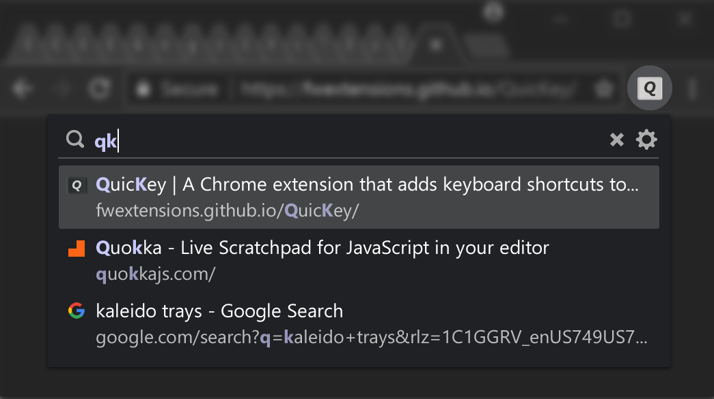

# *QuicKey*

[![Rating][rating-badge]][rating]
[![Version][version-badge]][version]

#### *QuicKey* lets you navigate all of your Chrome tabs by typing just part of a page's title or URL.  No mouse needed!

  * Press <b><kbd>alt</kbd><kbd>Q</kbd></b> (<b><kbd>ctrl</kbd><kbd>Q</kbd></b> on macOS).
  * Type a few letters.
  * Press <kbd>enter</kbd> to switch to the selected tab.

To toggle between the two most recently used tabs, quickly press the keyboard shortcut twice.  Or pick a tab from the most recently used (MRU) list as [shown below](#mru).

## Use <b><kbd>ctrl</kbd><kbd>tab</kbd></b> as a QuicKey shortcut

With a little extra work, you can even make *QuicKey* respond to the Holy Grail of keyboard shortcuts: <b><kbd>ctrl</kbd><kbd>tab</kbd></b>.  [Learn how](ctrl-tab).

## Installation

Install *QuicKey* from the <a href="https://chrome.google.com/webstore/detail/quickey-–-the-quick-tab-s/ldlghkoiihaelfnggonhjnfiabmaficg">Chrome Web Store</a>.

Once the extension is installed, you can click the  button on the toolbar to open the search box.  But if you like this extension, you'll probably prefer using the default keyboard shortcut listed above.

You can customize the shortcut key by right-clicking the *QuicKey* icon and selecting *Options*.  Or manually add a <b><kbd>ctrl</kbd><kbd>tab</kbd></b> [keyboard shortcut](ctrl-tab).

## Switch between the most recently used tabs

> **Note:** When first installed, *QuicKey* doesn't know which tabs have been recently used, but as you use Chrome, tabs will get added to the most recently used (MRU) list.

Opening *QuicKey* displays a list of the last 50 tabs you've visited, in order of recency.  Click a tab to switch to it, or use one of the keyboard shortcuts below to navigate the recently used tab history:

&nbsp;

  * **To switch between the two most recent tabs:**
      * Press <b><kbd>alt</kbd><kbd>Z</kbd></b> (<b><kbd>ctrl</kbd><kbd>Z</kbd></b> on macOS). 
          * **OR**      
      * Quickly double-press <b><kbd>alt</kbd><kbd>Q</kbd></b> (<b><kbd>ctrl</kbd><kbd>Q</kbd></b> on macOS).

&nbsp;

  * **To navigate farther back in the MRU list:**
    * Press <b><kbd>alt</kbd><kbd>A</kbd></b> (<b><kbd>ctrl</kbd><kbd>A</kbd></b> on macOS) once to switch to the previous tab.  The *QuicKey* icon will invert for .75 seconds: <b> ➤ </b>.
    * Press <b><kbd>alt</kbd><kbd>A</kbd></b> again while the icon is inverted to switch to older tabs, once for each tab.
    * Press <b><kbd>alt</kbd><kbd>S</kbd></b> to move to newer tabs.
    * Pause to let the icon revert to normal: <b> ➤ </b>.
    * Press <b><kbd>alt</kbd><kbd>A</kbd></b> again to switch back to the tab you initially started on.

&nbsp;

  * **To pick a recent tab from the MRU menu:**
    * Press the shortcut but keep holding the <kbd>alt</kbd> key (<kbd>ctrl</kbd> key on macOS).
    * Press <kbd>W</kbd> or <kbd>↓</kbd> to move down through the list of recent tabs.
    * Press <b><kbd>shift</kbd><kbd>W</kbd></b> or <kbd>↑</kbd> to move up.
    * Release <kbd>alt</kbd> (or <kbd>ctrl</kbd>) to switch to the selected tab.
    * You can also highlight an item with the mouse, then release <kbd>alt</kbd> to go to that tab.

Which shortcuts to use is up to you.  Double-pressing <b><kbd>alt</kbd><kbd>Q</kbd></b> is nice because there's just one shortcut to remember, while <b><kbd>alt</kbd><kbd>Z</kbd></b> lets you switch between the two most recently used tabs very rapidly.  (You can also double-click the *QuicKey* icon to toggle between the most recent tabs.)

<b><kbd>alt</kbd><kbd>A</kbd></b> lets you navigate to even older tabs, though the timing can sometimes be finicky.

Selecting from the MRU menu by holding down the <kbd>alt</kbd> key provides the closest experience to a typical <b><kbd>alt</kbd><kbd>tab</kbd></b> menu, but you need to use <kbd>W</kbd> instead of <kbd>tab</kbd> to navigate while the menu is open (due to limitations in the Chrome platform).

You can change any of these shortcuts by clicking the  icon in the menu or by right-clicking the *QuicKey* icon and selecting *Options*.  Then scroll down and click *Change browser shortcuts*. Look for the *Switch to the previous/next tab* shortcuts.

If you enable the option to show the number of open tabs on the *QuicKey* icon, the badge containing that number will change color while you navigate to older tabs, rather than the icon inverting.

## Search for a tab quickly

Unlike other tab switchers, *QuicKey* uses a [Quicksilver](https://qsapp.com/)-style search algorithm to rank the results, where contiguous matches at the beginning of words are higher in the list, as are matches against capital letters.  So you only have to type a few letters to quickly find the right tab.

Use keyboard shortcuts to navigate the list of matching tabs:

  * <kbd>enter</kbd>&nbsp;: switch to the selected tab
  * <kbd>↓</kbd> or <kbd>space</kbd>&nbsp;: move down the list
  * <kbd>↑</kbd> or <b><kbd>shift</kbd><kbd>space</kbd></b>&nbsp;: move up the list
  * <kbd>pg dn</kbd>&nbsp;: page down the list
  * <kbd>pg up</kbd>&nbsp;: page up the list
  * <kbd>end</kbd>&nbsp;: go to the bottom of the list
  * <kbd>home</kbd>&nbsp;: go to the top of the list
  * <kbd>esc</kbd>&nbsp;: clear the search or close the menu

If you type more than 25 letters, which should be plenty to find the right tab, *QuicKey* switches to an exact string search to stay fast.

Recently used tabs get a slight boost in the search results ranking, so getting back to a tab you were just using should require typing fewer letters.

## Customize shortcuts and other options

To customize how *QuicKey* behaves, click the  icon in the menu, or right-click its toolbar icon  and select *Options* from the menu:

On the *QuicKey options* page, you can change the behavior of the <kbd>space</kbd> and <kbd>esc</kbd> keys, mark tabs in other windows with an icon, hide closed tabs from the search results, show the number of open tabs, and customize many of the keyboard shortcuts described here.

If you change the keyboard shortcut for showing the *QuicKey* menu to something other than the default <b><kbd>alt</kbd><kbd>Q</kbd></b> or if you have a non-US keyboard, you'll probably want to also change the key that's used to navigate down the list of recently used tabs (which defaults to <kbd>W</kbd>).  For instance, if you change the menu shortcut to <b><kbd>alt</kbd><kbd>Z</kbd></b>, you might want to change the navigation key to <kbd>X</kbd>, which is right next door.  To change it, go to the *Options* page, click in the first keyboard shortcut picker, and press <kbd>X</kbd>.

If new settings have been added to *QuicKey* since the last time you looked at the options page, the  icon will display a red dot to let you know.

## Close and reopen tabs

To close the selected tab, press <b><kbd>ctrl</kbd><kbd>W</kbd></b> (<b><kbd>cmd</kbd><kbd>ctrl</kbd><kbd>W</kbd></b> on macOS).  Or hover over a tab and click the close button on the right side of the menu:

When you open *QuicKey*, the 25 most recently closed tabs are listed below the recent tabs and shown in a faded state with a  icon:

They are also returned when you type a query, though their rank in the list of results is lower than open tabs.  Click a closed tab to reopen it in its original location and with all of its browsing history intact.

If you don't want any closed tabs to be shown, open the *QuicKey options* page and uncheck *Include recently closed tabs in the search results*.  You can also remove the selected closed tab from the browser's history by pressing <b><kbd>ctrl</kbd><kbd>W</kbd></b> (<b><kbd>cmd</kbd><kbd>ctrl</kbd><kbd>W</kbd></b> on macOS) or by clicking its  button on the right side of the menu. 

## Move tabs

You can move tabs to the left or right of the current tab, making it easy to pull tabs from other windows into the current one, or to rearrange tabs without using the mouse.

  * Press <b><kbd>ctrl</kbd><kbd>[</kbd></b> to move the selected tab to the left of the current one.
  * Press <b><kbd>ctrl</kbd><kbd>]</kbd></b> to move it to the right.

The <kbd>ctrl</kbd> key should be used on both Windows and macOS.  Note that you cannot move tabs between normal and incognito windows.

## Distinguish tabs with identical titles

A tab that has the same title as other open tabs will display a number to indicate its left-to-right position among those other tabs.  For instance, if you open tabs for two different Google Drive accounts, they'll both be titled *My Drive - Google Drive*.  But the one on the left will show a **1** next to its title in the menu and the one on the right will show a **2**.  This makes it easier for you to select the tab you want when you know how they're organized in your window.   

## Search bookmarks

To find a bookmark, type <b><kbd>/</kbd><kbd>b</kbd><kbd>space</kbd></b> in the search box, and then part of the bookmark's name or URL.

  * Press <kbd>enter</kbd> to open the bookmark in the current tab.
  * Press <b><kbd>ctrl</kbd><kbd>enter</kbd></b> (<b><kbd>cmd</kbd><kbd>enter</kbd></b> on macOS) to open it in a new tab in the current window.
  * Press <b><kbd>shift</kbd><kbd>enter</kbd></b> to open it in a new window.

As soon as you type <b><kbd>/</kbd><kbd>b</kbd><kbd>space</kbd></b>, your bookmarks will be listed in alphabetical order, in case you want to browse through them.  Since bookmarks can be organized into folders, the folder path is shown before each bookmark's title.  The folder path can be hidden by unchecking *Show the folder path to each bookmark in its title* on the Options page.

## Search the browser history

To find something in the last 2000 pages of your browser history, type <b><kbd>/</kbd><kbd>h</kbd><kbd>space</kbd></b> in the search box, and then part of the page's name or URL.

The same <b><kbd>ctrl</kbd><kbd>enter</kbd></b> (<b><kbd>cmd</kbd><kbd>enter</kbd></b> on macOS) and <b><kbd>shift</kbd><kbd>enter</kbd></b> shortcuts will open the visited page in a new tab or window.

As soon as you type <b><kbd>/</kbd><kbd>h</kbd><kbd>space</kbd></b>, the pages from your history will be listed in order of recency, so you can get back to a page you had recently visited without having to remember its name.

## Delete bookmarks and history items

To delete the selected bookmark or history item, press <b><kbd>ctrl</kbd><kbd>W</kbd></b> (<b><kbd>cmd</kbd><kbd>ctrl</kbd><kbd>W</kbd></b> on macOS). Or hover over an item and click the  button on the right side of the menu. You'll be asked to confirm the deletion of bookmarks.

## Incognito mode

To switch to incognito tabs as well as normal ones, click the  icon in the menu, or right-click the *QuicKey* icon  and select *Options* from the menu:

Scroll to the very bottom of the *QuicKey options* page and then click the *Change incognito settings* button.  On the extensions page that opens, scroll down to the *Allow in incognito* option and click the toggle button:

Tabs in incognito mode display the incognito icon under the page's favicon, so you can distinguish a normal tab from an incognito one with the same title:

## Dark mode

*QuicKey* will respond to changes in your computer's dark mode setting with darker colors that match your browser's user interface.

## Copy a URL or title

You can also copy the URL and title of the selected tab, bookmark or history item:

  * Press <b><kbd>ctrl</kbd><kbd>C</kbd></b> (<b><kbd>cmd</kbd><kbd>C</kbd></b> on macOS) to copy just the URL.
  * Press <b><kbd>ctrl</kbd><kbd>shift</kbd><kbd>C</kbd></b> (<b><kbd>cmd</kbd><kbd>shift</kbd><kbd>C</kbd></b> on macOS) to copy both the item's title and its URL, one per line.

## Privacy policy

When first installed, *QuicKey* asks for these permissions:

- *Read and change your browsing history on all signed-in devices*

    *QuicKey* uses this permission to let you search the titles and URLs of the open tabs, as well as pages from your history. The *"all signed-in devices"* part is there only so that recently closed tabs can be restored with their full history. The only time *QuicKey* changes your browsing history is when you choose to delete a history item. 

- *Read and change your bookmarks*

    *QuicKey* uses this permission to let you search the titles and URLs of your bookmarked pages. The only time it changes your bookmarks is when you choose to delete one.

*QuicKey* can't access or manipulate the content of any pages you visit and doesn't transmit any information other than some anonymized diagnostic data.

If you right-click the *QuicKey* icon on the toolbar, there's a message saying *Can't read or change site's data*, which is a bit misleading, since it can't read or change *any* site's data, not just the current one.

## Feedback and support

If you find a bug in *QuicKey* or have a suggestion for a new feature, please [create a new issue](https://github.com/fwextensions/QuicKey/issues/new) on its GitHub page.

## Release history

View the changes in [previous releases](https://fwextensions.github.io/QuicKey/releases/).

## Credits

The , , ,  and  icons are from the [Octicons](https://octicons.github.com/) set, used under the [MIT License](http://opensource.org/licenses/MIT).  The  icon is from the [Material Icons](https://material.io/tools/icons/) set, used under the [Apache License](https://www.apache.org/licenses/LICENSE-2.0.html).

The string ranking algorithm is modeled on [Quicksilver](https://github.com/quicksilver/Quicksilver/blob/master/Quicksilver/Code-QuickStepCore/QSense.m)'s code.

[rating-badge]: https://img.shields.io/chrome-web-store/stars/ldlghkoiihaelfnggonhjnfiabmaficg.svg?style=flat-square&label=Rating
[rating]: https://chrome.google.com/webstore/detail/quickey-–-the-quick-tab-s/ldlghkoiihaelfnggonhjnfiabmaficg
[version-badge]: https://img.shields.io/chrome-web-store/v/ldlghkoiihaelfnggonhjnfiabmaficg.svg?style=flat-square&label=Version
[version]: https://chrome.google.com/webstore/detail/quickey-–-the-quick-tab-s/ldlghkoiihaelfnggonhjnfiabmaficg
