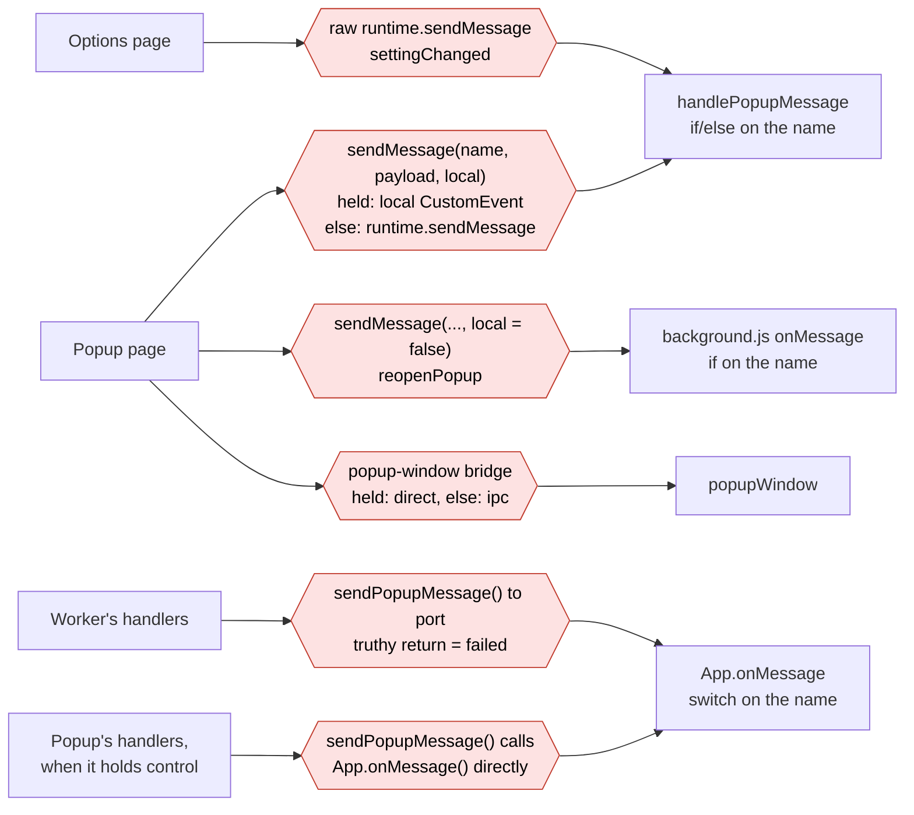
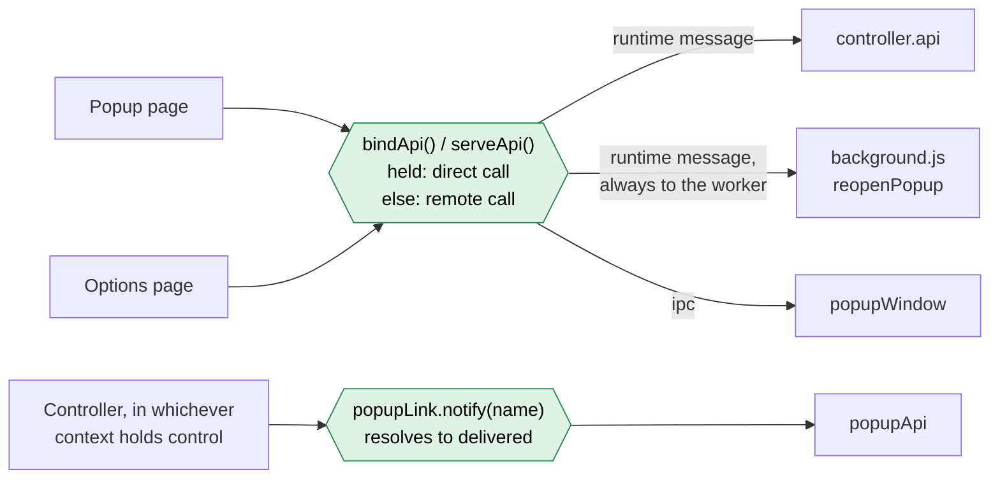

# Controller refactor plan

A plan for two related changes on `dev`:

1. Make "the context that holds control" a single explicit object, instead of
   state spread across `shared/state.js`, module-level variables, and values
   injected through `init(context)`.
2. Give the popup, the options page and the controller one call path between
   them, instead of three transports plus `control.isHeld()` branches at each
   call site.

Both are refactors. Behavior shouldn't change, and every phase below leaves
`npm run test:all` green and is shippable on its own.


## Status

Phases 0 to 3 are done. Phases 4 and 5 haven't been started. The
implementation differs from the design below in these ways:

- **Controller to popup still goes over the port, not `ipc`.** The port has
  to stay anyway, for lifecycle: `init.js` connects it before React loads,
  so the worker sees the toolbar menu close even if it never finished
  loading, which is how a double-press of the menu's shortcut (alt-E)
  toggles tabs. Since it exists and already tells the menu and the popup
  apart, the controller's messages ride on it rather than on a second
  channel. `ipc` would also work for the popup window, which is normally
  loaded and hidden, but it wouldn't gain anything. Phase 2 replaced the
  string switch with a `popupApi` object on top of the port.
- **Popup and options to controller go over `chrome.runtime.sendMessage`,
  not `ipc`.** Only the context that holds control registers a listener
  (`serveApi()` in `controller.start()`), so exactly one context answers.
  That avoids the `ipc` broadcast problem described under risks. The client
  is `createControllerClient()` in `shared/controller-api.js`, built on
  `bindApi()` in `shared/api.js`.
- **`popupLink.notify()` resolves to whether the message was delivered,**
  rather than rejecting, so fire-and-forget callers don't create unhandled
  rejections.
- **`reopenPopup` stays in the worker.** `background.js` serves it with
  `serveApi()`. A popup that holds control can't recreate its own window,
  because `create()` closes the existing popup first.
- **`closedByEsc` stays on the port.** It only matters to the worker's
  double-press detection, which is tied to the port's lifecycle. That
  detection is for the toolbar menu; the popup window's page is hidden and
  reused, so its port doesn't connect and disconnect on each use.
- **The controller still imports its leaf modules** (`popupWindow`,
  `toolbarIcon`, `recentTabs`, `settings`) rather than taking them as
  arguments. Tests replace them with `vi.mock()`. Only `popupLink` is
  injected.
- **API renames:** `executeAddTab` is now `flushAddTab`, and
  `settingChanged` is now `applySetting`. The popup's `focusSearch`
  message was removed, since nothing sent it.
- **Bug fixed along the way:** `reopenPopup` passed `true` as the popup's
  props, which dropped `focusSearch` when the popup reopened itself.


## Control flow, before and after

These diagrams leave out the modules and show only how one context calls
another. Callers are on the left, receivers on the right, and each
hexagon is a separate way of making a cross-context call, with its own
conventions. The port's connect and disconnect events and `closedByEsc`
aren't shown, since they work the same way before and after.

| | Before | After |
|---|---:|---:|
| Ways to call across contexts | 6 | 2 |
| Receivers that dispatch on a message name with `if`/`switch` | 3 | 0 |
| `control.isHeld()` checks that choose a message path | 3 | 2 |
| Return conventions | 3 (response, none, truthy = failed) | 1 (a promise) |

### Before



### After



Everything that calls into the controller, `reopenPopup` or the popup
window now goes through one helper pair, and everything the controller
sends to the popup goes through `popupLink`. In both cases the receiver is a
plain object of methods, so a new call is a new method, not a new branch in
a dispatcher. The one `isHeld()` check left outside `bindApi()` is the
`closedByEsc` port message in `App.closeWindow()`.


## Where things stand

### Who holds control

The worker and the hidden popup page each import the same `shared/` graph and
call `initEventController()`. Whichever context gets the `__control__` web lock
first runs the command and tab handlers. If the worker dies, the queued popup
inherits the lock and takes over. `controlledEvent.js` queues Chrome events
that arrive before the lock is granted and replays them afterwards.

That design works and has good tests (`worker-popup-control.test.js`,
`control.test.js`, `control-handoff` and `control-thenable` regressions). The
problem is how the controller's pieces find each other:

| Piece | Where it lives today |
|---|---|
| `startingUp`, `activeTab`, `navigatingRecents`, `navigateRecentsWithPopup` | `shared/state.js`, a mutable singleton read and written from five modules |
| `currentWindowLimitRecents` | module `let` in `commandHandlers.js` |
| `lastOpenPromise`, `lastTogglePromise`, `menuOpen`, `commandsEnabled` | module `let`s in `commandHandlers.js` |
| `lastWindowID` | module `let` in `tabEventHandlers.js` |
| `ports`, `sendPopupMessage` | passed to `initEventController()`, then copied into module `let`s in both handler modules |
| setup that only runs once control is held | a function returned from each `init()`, collected by `eventController.js` |

The popup's call to `initEventController()` passes `ports: { popup: {} }`, a
dummy object that's only there to make `if (ports.popup)` true.

### How messages move

| Direction | Messages | Transport |
|---|---|---|
| controller → popup/menu | `modifySelected`, `showWindow`, `tabActivated`, `stopNavigatingRecents` | port `postMessage` in the worker; a direct `this.onMessage()` call when the popup holds control. A truthy return from `sendPopupMessage()` means "failed", and `openPopupWindow()` closes the popup on it. |
| popup → controller | `getActiveTab`, `stopNavigatingRecents`, `executeAddTab` | `MessageTarget.sendMessage()`: a local `CustomEvent` that mimics `runtime.onMessage` when the popup holds control, otherwise `chrome.runtime.sendMessage()` |
| popup → worker | `reopenPopup` | `chrome.runtime.sendMessage()`, handled only in `background.js`, not by the controller |
| popup → worker | `closedByEsc` | port `postMessage`, skipped when the popup holds control |
| options → controller | `settingChanged` for four hand-listed keys | `chrome.runtime.sendMessage()`. `MessageTarget.addListener()` registers on `runtime.onMessage` too, so this reaches a popup that holds control. |
| popup → popup-window | `show`, `hide`, `blur`, `resize` | `lib/ipc` channel `popup-window`, or a direct call when the popup holds control (`popup/popup-window.js`) |
| popup → toolbar icon | `setColorScheme`, `setTabCount` | `lib/ipc` channels `colorScheme` and `tabCount` |

`popup/popup-window.js` already does what the rest should do: call the
implementation directly when this context holds control, otherwise go through
`ipc`. Its own TODO asks for this pattern to be pushed into the event
controller.


## Target design

### The controller

A factory in `src/js/shared/controller.js`:

```js
export function createController({ popupLink, popupWindow, toolbarIcon,
	recentTabs, settings, tracker, log })
{
	const state = {
		startingUp: false,
		activeTab: null,
		navigatingRecents: false,
		navigateRecentsWithPopup: false,
		currentWindowLimitRecents: false,
	};
	let openQueue = Promise.resolve();
	let toggleQueue = Promise.resolve();

	// ...handlers from commandHandlers.js and tabEventHandlers.js, closed
	// over state and the injected dependencies...

	return {
			// called once, from inside control.claimWhenAvailable()
		async start() { /* enable commands, load settings, attach listeners */ },

			// the API other contexts call (see below)
		api: {
			getActiveTab: () => state.activeTab,
			stopNavigatingRecents() { state.navigatingRecents = false; },
			flushAddTab: () => addTab.flush(),
			reopenPopup({ focusSearch }) { /* moved from background.js */ },
			applySetting(key, value) { /* the settingChanged branch */ },
			popupClosing({ byEsc }) { /* replaces the closedByEsc port message */ },
		},

			// for background.js lifecycle code and for tests
		state,
	};
}
```

- `state.js` and `eventController.js` go away. `commandHandlers.js` and
  `tabEventHandlers.js` become plain functions that take the controller's
  closure (or get folded into `controller.js` if that reads better after the
  move).
- Dependencies are passed in instead of imported. The production entry points
  pass the real modules. Tests pass fakes and no longer need
  `vi.resetModules()` per context just to get fresh state. The multi-context
  harness in `test/support/context.js` stays for the lock-handoff tests,
  where separate module graphs are the point.
- `popupLink` replaces both `ports` and `sendPopupMessage`:

```js
	// what the controller needs to know about the popup and menu
const popupLink = {
	isPopupConnected() {},		// replaces `ports.popup`
	isMenuConnected() {},		// replaces `ports.menu`
	notify(message, payload) {},	// returns a promise that rejects if undeliverable
};
```

  The worker builds it from the ports `background.js` tracks. The popup builds
  it around its own `App`. The `ports: { popup: {} }` dummy goes away, and so
  does the "a truthy return means failure" rule: `openPopupWindow()` catches a
  rejected `notify()` and closes the popup.

### One call path

Two APIs, each with a fixed list of method names:

- **`ControllerApi`** (popup and options → controller): the `api` object
  above.
- **`PopupApi`** (controller → popup or menu): `modifySelected`, `showWindow`,
  `tabActivated`, `stopNavigatingRecents`. The `App` methods that already
  exist implement it. The `switch` in `App.onMessage` goes away.

Both use one helper that generalizes `popup/popup-window.js`:

```js
	// src/js/shared/bind-api.js
export function bindApi(
	channelName,
	methodNames,
	getLocal)
{
	const { call } = connect(channelName);

	return Object.fromEntries(methodNames.map((name) => [
		name,
		(...args) => control.isHeld()
			? getLocal()[name](...args)
			: call(name, ...args)
	]));
}
```

- The holder registers `connect("controller").receive(controller.api)` inside
  `start()`, so only the context that holds control answers.
- The popup does `const controller = bindApi("controller", ControllerApiNames,
  () => localController.api)`. `app.jsx` calls `controller.getActiveTab()`
  and so on. `sendMessage()`, `sendRuntimeMessage` and the `local` flag go
  away.
- The options page always calls remotely, since it never holds control.
- `popup/popup-window.js` becomes a `bindApi("popup-window", ...)` call.
- The port stays, but only for lifecycle: its connect and disconnect are how
  the worker tracks whether the popup or menu is open and detects a
  double-press. Nothing else goes over it.


## Phases

### Phase 0: lock down the current behavior

Before moving anything, add the tests that the later phases need to keep
passing. Most of the coordination story is covered already. These are the
gaps:

- [x] With the popup holding control, `getActiveTab` from the popup returns
      the controller's `activeTab` (local path).
- [x] With the popup holding control, a `settingChanged` from the options page
      reaches the popup's handler.
- [x] `openPopupWindow()` closes the popup when delivering `modifySelected`
      fails.
- [x] A popup port that connects and disconnects within `MaxPopupLifetime`
      without `closedByEsc` triggers exactly one toggle, and one that sent
      `closedByEsc` doesn't.
- [x] `reopenPopup` still reopens with the same `activeTab`.

### Phase 1: introduce the controller (item 1)

Transport stays exactly as it is. Only the ownership moves.

1. Create `shared/controller.js` with `createController()`. Move the state
   from `state.js` and the module `let`s from both handler modules into it.
2. Turn `commandHandlers.js` and `tabEventHandlers.js` into functions that take
   the controller's internals, and move the "runs once control is held" setup
   into `start()`.
3. Add `popupLink`. In the worker, it wraps the `ports` object and the
   existing `postMessage` call. In the popup, it wraps `App.onMessage`. Keep
   `notify()` returning the old truthy-on-failure value for now, so
   `openPopupWindow()` doesn't change yet.
4. Point `background.js` and `app.jsx` at
   `control.claimWhenAvailable(() => controller.start())`. The `onStartup` and
   `onConnect` code in `background.js` sets `controller.state.startingUp`
   instead of `state.startingUp`.
5. Delete `state.js`. Reduce `eventController.js` to the `MessageTarget` class
   (it goes in phase 3).
6. Add `test/unit/controller.test.js`, which builds a controller with fakes and
   exercises open, navigate and toggle without the multi-context harness.

### Phase 2: controller → popup over `PopupApi`

1. Add `bindApi()` (above), plus a fire-and-forget `notify()` to `lib/ipc`.
   The controller must not wait for the popup to finish handling a message:
   `showWindow` awaits `loadTabs()`, and waiting on it inside the open queue
   would slow every repeated alt-Q. `notify()` resolves once the message has
   been posted and rejects if there's no channel.
2. The popup registers `connect("popup").receive(popupApi)` at mount. The
   worker's `popupLink.notify()` sends over that channel instead of the port.
3. Change `openPopupWindow()` to `await popupLink.notify(...)` and close the
   popup on rejection. Drop the truthy-return convention.
4. Delete the `switch` in `App.onMessage`. Rename the handlers if needed so
   they match `PopupApi`.

### Phase 3: popup and options → controller over `ControllerApi`

1. The holder registers `connect("controller").receive(controller.api)` in
   `start()`.
2. Replace every `this.sendMessage(...)` in `app.jsx` with a call on the
   `bindApi("controller", ...)` client. Move `reopenPopup` from
   `background.js` into `controller.api`.
3. Replace `closedByEsc` with `controller.popupClosing({ byEsc: true })`. The
   worker records it against the port, so the disconnect handler still sees
   it. This also removes the `!control.isHeld()` special case in
   `closeWindow()`.
4. Switch the options page's `settingChanged` to `controller.applySetting()`.
5. Rewrite `popup/popup-window.js` as a `bindApi()` call.
6. Delete `MessageTarget`, `handlePopupMessage`, `eventController.js`, and
   the `runtime.onMessage` listener in `background.js`.

### Phase 4 (optional): settings through `storage.onChanged`

Item 3 from the review fits here. Instead of `applySetting()`, `start()`
subscribes to `chrome.storage.onChanged`, compares the old and new
`data.settings`, and applies whatever changed. That deletes the four-key list
in `options/app-container.jsx` and `applySetting()` itself. It also means a
setting can't go stale because a message was dropped.

### Phase 5: cleanup

- Remove the commented-out `startingUp` and `onCommandListener` blocks in the
  handler modules.
- Fix the undefined `warn()` at `popup/app.jsx:1484` if it hasn't already been
  fixed separately.
- Update `worker-popup-control.test.js` to assert on the API calls rather than
  `sendMessage` and `sendPopupMessage` mocks.


## Risks and open questions

- **`ipc` broadcast semantics.** `connect()` opens a channel to every context
  whenever `getContexts()` reports more than one. `call()` with several open
  channels sends to all of them and returns `Promise.allSettled()`. A context
  with no receiver queues the call indefinitely. That's harmless today because
  each channel has one receiver. With a `controller` channel, only the holder
  may receive, so this needs a test with both contexts alive. One option is to
  have a non-holder reject `controller` calls instead of queueing them.
- **Receivers registered at import time.** `toolbar-icon.js` registers its
  `colorScheme` and `tabCount` receivers when the module loads, in every
  context that imports it, the popup included. That works only because the
  popup's own calls are local. Moving those receivers into `start()` would
  make them follow control like everything else. That's a small extension to
  phase 3, not a requirement.
- **`startingUp` in the popup.** `onStartup` runs in the worker and sets the
  worker's copy of the flag. A popup that holds control has its own copy,
  which never sees it. That's the existing behavior, and phase 1 keeps it.
  Should the controller instead derive "starting up" from `lastStartupTime` in
  storage, so it's correct in either context?
- **Per-context `popupWindow` state.** Each context has its own instance of
  `background/popup-window.js`, so its `windowID` and `isVisible` exist once
  per context (see `popup-window-resync.test.js`). Passing `popupWindow` into
  the controller makes this dependency visible but doesn't change it. Making
  the controller the only owner is a candidate for a later pass.
- **Timing.** The open and toggle queues depend on what is awaited and what
  isn't. Phase 2's `notify()` is fire-and-forget for that reason. The
  regression suite (`toggle-queue`, `toggle-window-limit`, `navigate-rematch`)
  needs to stay green after every phase, along with manual checks of repeated
  alt-Q, held alt-S, double-press alt-E, and navigating with the popup.


## Files touched

| File | Phase | Change |
|---|---|---|
| `src/js/shared/controller.js` | 1 | new |
| `src/js/shared/bind-api.js` | 2 | new |
| `src/js/shared/state.js` | 1 | deleted |
| `src/js/shared/eventController.js` | 1, 3 | reduced, then deleted |
| `src/js/shared/commandHandlers.js` | 1, 3 | takes the controller; `handlePopupMessage` deleted |
| `src/js/shared/tabEventHandlers.js` | 1, 2 | takes the controller; uses `popupLink.notify()` |
| `src/js/shared/addTab.js` | 1 | writes `activeTab` through the controller |
| `src/js/background/background.js` | 1, 3 | builds `popupLink` and the controller; `onMessage` listener removed |
| `src/js/popup/app.jsx` | 1–3 | `PopupApi` handlers; `ControllerApi` client; `onMessage` switch and `sendMessage` removed |
| `src/js/popup/popup-window.js` | 3 | becomes a `bindApi()` call |
| `src/js/options/app-container.jsx` | 3, 4 | `applySetting()`, then nothing |
| `src/js/lib/ipc.js` | 2 | adds `notify()`; non-holder behavior for `controller` |
| `test/unit/controller.test.js` | 1 | new |
| `test/unit/worker-popup-control.test.js` | 0, 5 | new cases, then API-based assertions |
