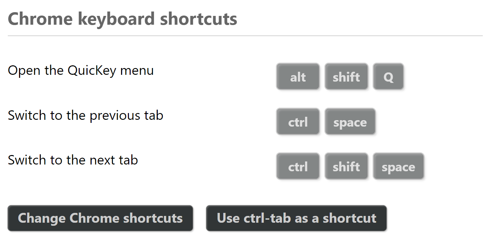
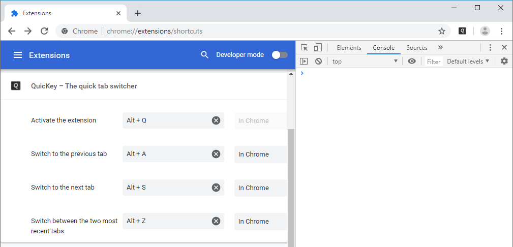
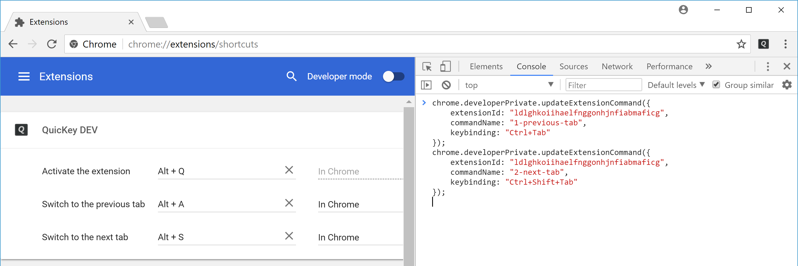
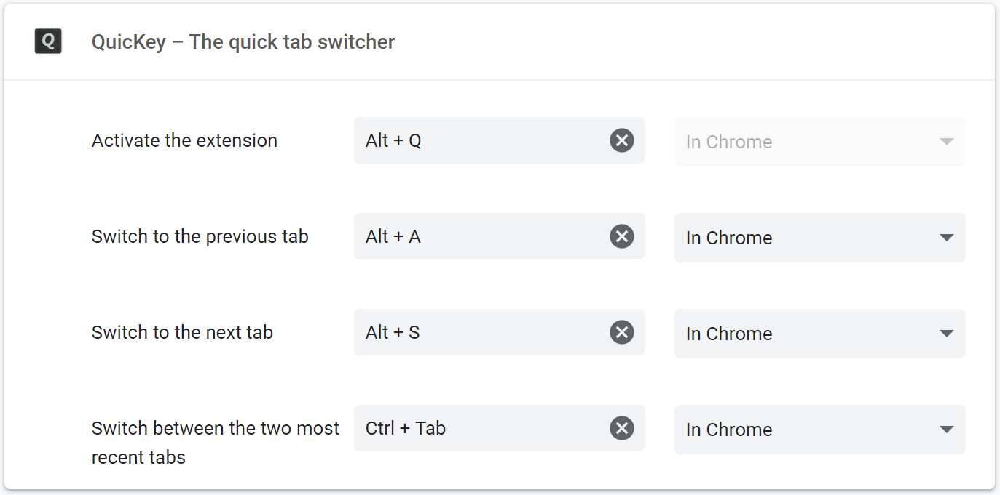
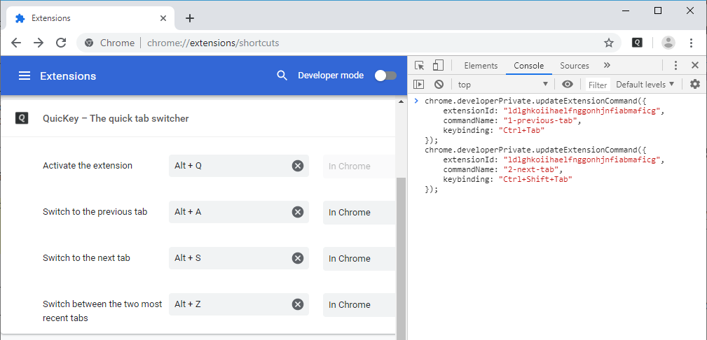
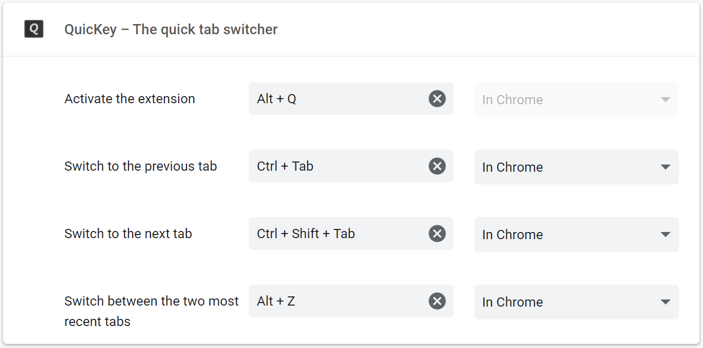
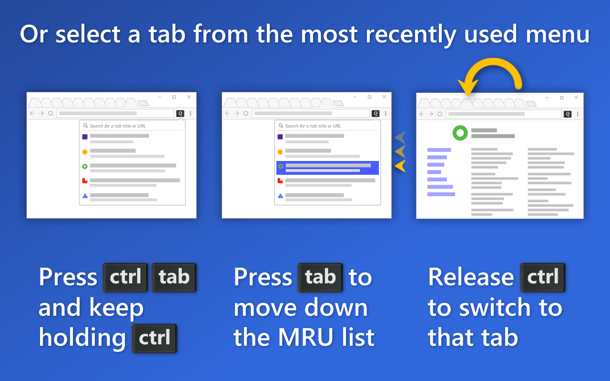

---

title: QuicKey
comments: true

---

# Use <b><kbd>ctrl</kbd><kbd>tab</kbd></b> as a QuicKey shortcut

Do you wish Chrome had the same <b><kbd>ctrl</kbd><kbd>tab</kbd></b> tab navigation as Firefox?  There are two key features Chrome is missing:

- **Switch to the previously used tab**
  - Press <b><kbd>ctrl</kbd><kbd>tab</kbd></b> and then release both keys

- **Select an open tab from a menu using the keyboard**
  - Press <b><kbd>ctrl</kbd><kbd>tab</kbd></b> but then release just <kbd>tab</kbd>
  - Press <kbd>tab</kbd> repeatedly to select older tabs in the menu
  - Release <kbd>ctrl</kbd> to switch to the selected tab

Chrome extensions can't provide this functionality all by themselves, unfortunately.  With a little work, however, it *is* possible to achieve both these features with *QuicKey*, though the second one requires some additional Windows-only software.  (*QuicKey* does support [keyboard-driven selection](/QuicKey/#mru-gif) of a tab from a menu without any additional setup; it's just that you can't use <b><kbd>ctrl</kbd><kbd>tab</kbd></b> as the shortcut without these workarounds.)

You can choose one of these <b><kbd>ctrl</kbd><kbd>tab</kbd></b> behaviors:

1. [<b><kbd>ctrl</kbd><kbd>tab</kbd></b> instantly switches between *only* the two most recent tabs](#option-1)
2. [<b><kbd>ctrl</kbd><kbd>tab</kbd></b> switches to *any* of the recent tabs, but requires a brief pause before you press it again to switch back](#option-2)
3. [<b><kbd>ctrl</kbd><kbd>tab</kbd></b> switches between the two most recent tabs *or* you can keep holding <kbd>ctrl</kbd> to select a recent tab from a menu (Windows only)](#option-3)

Just don't follow the steps in more than one of these options.  If you later change your mind, you can always go back to the *Keyboard shortcuts* screen and click the clear button next to the shortcuts, or change them to something else 

Note that with any option, you'll naturally lose the <b><kbd>ctrl</kbd><kbd>tab</kbd></b> and <b><kbd>ctrl</kbd><kbd>shift</kbd><kbd>tab</kbd></b> keyboard shortcuts to move the next or previous tab within the current window.  On Windows and Linux, you can still use <b><kbd>ctrl</kbd><kbd>pg dn</kbd> / <kbd>pg up</kbd></b> to move to the next/previous tab, and on macOS you can use <b><kbd>cmd</kbd><kbd>opt</kbd><kbd>→</kbd> / <kbd>←</kbd></b>.

## Option 1: Use <b><kbd>ctrl</kbd><kbd>tab</kbd></b> to instantly switch between the two most recent tabs

Chrome's *Keyboard shortcuts* screen normally blocks you from using <b><kbd>ctrl</kbd><kbd>tab</kbd></b> as a shortcut, but it is possible to use the Chrome developer tools to work around this limitation. (This is also much simpler and more reliable than other approaches that require messing around with Chrome's preferences files.)

1. [Install QuicKey](https://chrome.google.com/webstore/detail/quickey-%E2%80%93-the-quick-tab-s/ldlghkoiihaelfnggonhjnfiabmaficg).

2. Right-click the *QuicKey* icon  and select *Options* from the menu.

    

3. Scroll down the *QuicKey Options* page and then click the *Change Chrome shortcuts* button.

    

4. After the *Keyboard shortcuts* page opens, press <b><kbd>ctrl</kbd><kbd>shift</kbd><kbd>J</kbd></b> on Windows/Linux or <b><kbd>cmd</kbd><kbd>opt</kbd><kbd>J</kbd></b> on macOS to open the Chrome DevTools.

    

5. Copy this block of code:

       chrome.developerPrivate.updateExtensionCommand({
           extensionId: "ldlghkoiihaelfnggonhjnfiabmaficg",
           commandName: "30-toggle-recent-tabs",
           keybinding: "Ctrl+Tab"
       });

    <button class="copy" onclick="copyCode(0)">Copy to Clipboard</button>

6. Click into the console area of DevTools and paste the code next to the `>`.

    

7. Press <kbd>enter</kbd> to run it.

    

That's it!

Now you can press <b><kbd>ctrl</kbd><kbd>tab</kbd></b> to switch to the previously used tab, and press it again to switch back.  Unlike [Option 2](#option-2) below, you can toggle between *only* the two most recent tabs, but the advantage is you can switch back and forth as quickly as you like. 

## Option 2: Use <b><kbd>ctrl</kbd><kbd>tab</kbd></b> to switch to any recently used tab

Follow [steps 1 through 4](#option-1-1) from option 1 above. 

5. Copy this block of code:

       chrome.developerPrivate.updateExtensionCommand({
           extensionId: "ldlghkoiihaelfnggonhjnfiabmaficg",
           commandName: "1-previous-tab",
           keybinding: "Ctrl+Tab"
       });
       chrome.developerPrivate.updateExtensionCommand({
           extensionId: "ldlghkoiihaelfnggonhjnfiabmaficg",
           commandName: "2-next-tab",
           keybinding: "Ctrl+Shift+Tab"
       });

    <button class="copy" onclick="copyCode(1)">Copy to Clipboard</button>

6. Click into the console area of DevTools and paste the code next to the `>`.

    

7. Press <kbd>enter</kbd> to run it.

    

That's it!

Now you can press <b><kbd>ctrl</kbd><kbd>tab</kbd></b> to switch to the previously used tab.  If you press it again within .75 seconds, while the icon is inverted , you'll switch to the tab before that.  You can press <b><kbd>ctrl</kbd><kbd>shift</kbd><kbd>tab</kbd></b> to navigate in the other direction.

(You should always be cautious about copying code from a website and running it in DevTools, but even if you don't know JavaScript, it's hopefully clear what the snippet above is doing.  It's calling a private `updateExtensionCommand()` function twice to set <b><kbd>ctrl</kbd><kbd>tab</kbd></b> and <b><kbd>ctrl</kbd><kbd>shift</kbd><kbd>tab</kbd></b> keyboard shortcuts.  The "ldlgh..." string is *QuicKey*'s extension ID, which you can see in its [Chrome webstore link](https://chrome.google.com/webstore/detail/quickey-%E2%80%93-the-quick-tab-s/ldlghkoiihaelfnggonhjnfiabmaficg), so this code won't affect any other extensions you have installed.)

## Option 3: Use <b><kbd>ctrl</kbd><kbd>tab</kbd></b> to switch to a recent tab via a menu (Windows only)

This option provides the closest experience to Firefox.  It lets you quickly press and release <b><kbd>ctrl</kbd><kbd>tab</kbd></b> to switch to the previous tab, or you can keep holding <kbd>ctrl</kbd> to select from a menu of recent tabs.

1. [Install QuicKey](https://chrome.google.com/webstore/detail/quickey-%E2%80%93-the-quick-tab-s/ldlghkoiihaelfnggonhjnfiabmaficg).

2. Download and install [AutoHotkey](https://www.autohotkey.com/download/ahk-install.exe), a Windows utility for remapping keys.

3. Press <b><kbd>Win</kbd><kbd>R</kbd></b> to open the *Run* dialog.  (Or click the Start menu, type "run", and pick the first result.)

4. Type `shell:startup` into the dialog and press <kbd>enter</kbd> to open your PC's startup folder.

6. Download [`quickey-ctrl-tab.ahk`](quickey-ctrl-tab.ahk), an AutoHotkey script that sets up the keyboard shortcuts for *QuicKey*.

7. Drag the `quickey-ctrl-tab.ahk` file to your startup folder and then double-click the file.

Now switch between a few different tabs in Chrome using the mouse (since *QuicKey* was just installed, it won't have any recent tab history).  Then press and release <b><kbd>ctrl</kbd><kbd>tab</kbd></b> to switch to the previous tab.

If you press <b><kbd>ctrl</kbd><kbd>tab</kbd></b> and keep holding <kbd>ctrl</kbd>, a menu of recent tabs will open.  Press <kbd>tab</kbd> to move the selection down in the list, <b><kbd>shift</kbd><kbd>tab</kbd></b> to move up.  When the desired tab is selected, release <kbd>ctrl</kbd> to switch to it.

The other default shortcuts continue to work, so you can still press <b><kbd>alt</kbd><kbd>Q</kbd></b> to open *QuicKey* and search for a tab by name or URL instead of picking a recent one.  Or you can press <b><kbd>alt</kbd><kbd>Z</kbd></b> to toggle between the two most recent tabs without opening a menu.

