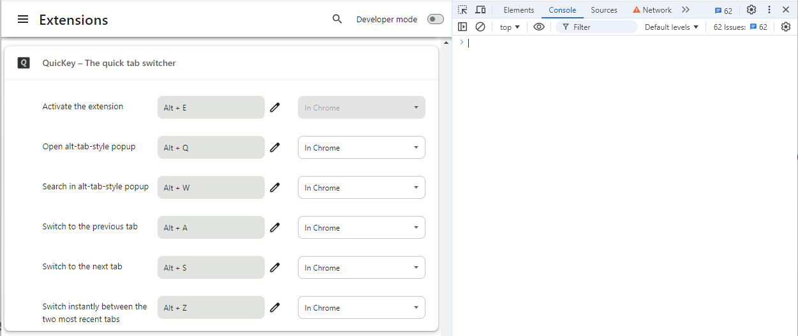

---

title: QuicKey
comments: true

---

# Use <b><kbd>ctrl</kbd><kbd>tab</kbd></b> as a QuicKey shortcut

Do you wish Chrome had the same <b><kbd>ctrl</kbd><kbd>tab</kbd></b> tab navigation as Firefox?  There are two key features Chrome is missing:

- <strong>Switch to the previously used tab</strong>
  - Press <b><kbd>ctrl</kbd><kbd>tab</kbd></b> and then release both keys
- <strong>Select an open tab from a menu using the keyboard</strong>
  - Press <b><kbd>ctrl</kbd><kbd>tab</kbd></b> but then release just <kbd>tab</kbd>
  - Press <kbd>tab</kbd> repeatedly to select older tabs in the menu
  - Release <kbd>ctrl</kbd> to switch to the selected tab

*QuicKey* 2.0 now provides this functionality right out of the box using the default <b><kbd>alt</kbd><kbd>Q</kbd></b> shortcut (<b><kbd>ctrl</kbd><kbd>Q</kbd></b> on macOS).  To change that shortcut to <b><kbd>ctrl</kbd><kbd>tab</kbd></b>, which the *Keyboard shortcuts* screen normally blocks you from using, you'll need to use Chrome's developer tools.  Just follow the steps below.

1. [Install QuicKey](https://chrome.google.com/webstore/detail/quickey-%E2%80%93-the-quick-tab-s/ldlghkoiihaelfnggonhjnfiabmaficg).

2. Click the  button in the top-right of the browser window and then select *Manage Extensions*.

    

3. Then click *Keyboard shortcuts* in the top-left of the page. 

    

4. Press <b><kbd>ctrl</kbd><kbd>shift</kbd><kbd>J</kbd></b> on Windows/Linux or <b><kbd>cmd</kbd><kbd>opt</kbd><kbd>J</kbd></b> on macOS to open the Chrome DevTools.

    

5. Copy this block of code:

       chrome.developerPrivate.updateExtensionCommand({
           extensionId: "ldlghkoiihaelfnggonhjnfiabmaficg",
           commandName: "010-open-popup-window",
           keybinding: "Ctrl+Tab"
       });

    <button class="copy" onclick="copyCode(0)">Copy to Clipboard</button>

6. Click into the console area of DevTools and paste the code next to the `>`.

    

7. Press <kbd>enter</kbd> to run it.

    

That's it!

Now you can press <b><kbd>ctrl</kbd><kbd>tab</kbd></b> to open the <em>QuicKey</em> popup window.  Keep holding <kbd>ctrl</kbd> to leave the window open as long as you like.  Press <kbd>tab</kbd> to move the selection down the list, or <b><kbd>shift</kbd><kbd>tab</kbd></b> to move the selection up.  Release <kbd>ctrl</kbd> to switch to the selected tab.

When the first tab is selected, you can also press <b><kbd>shift</kbd><kbd>tab</kbd></b> to move the focus up into the search box.  Then release <kbd>ctrl</kbd> and start typing to search for the desired tab.

Note that you'll naturally lose the <b><kbd>ctrl</kbd><kbd>tab</kbd></b> and <b><kbd>ctrl</kbd><kbd>shift</kbd><kbd>tab</kbd></b> keyboard shortcuts to move to the next or previous tab within the current window.  On Windows and Linux, you can still use <b><kbd>ctrl</kbd><kbd>pg dn</kbd> / <kbd>pg up</kbd></b> to move to the next/previous tab, and on macOS you can use <b><kbd>cmd</kbd><kbd>opt</kbd><kbd>→</kbd> / <kbd>←</kbd></b>.

Also note that if you're using Microsoft Edge and installed <em>QuicKey</em> from the Edge Web Store, you'll need to replace the <code>mcjciddpjefdpndgllejgcekmajmehnd</code> string in the code above with <code>ldlghkoiihaelfnggonhjnfiabmaficg</code>, which is <em>QuicKey</em>'s extension ID in that store.

(You should always be cautious about copying code from a website and running it in DevTools, but even if you don't know JavaScript, it's hopefully relatively clear what the snippet above is doing.  It's calling a private `updateExtensionCommand()` function to set a <b><kbd>ctrl</kbd><kbd>tab</kbd></b> keyboard shortcut for the *Open alt-tab-style popup* command.  The `"ldlgh..."` string is *QuicKey*'s extension ID, which you can see in its [Chrome Web Store link](https://chrome.google.com/webstore/detail/quickey-%E2%80%93-the-quick-tab-s/ldlghkoiihaelfnggonhjnfiabmaficg), so this code won't affect any other extensions you may have installed.)

