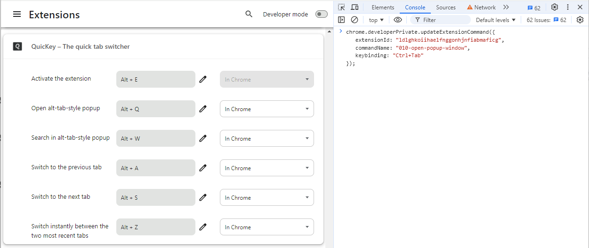
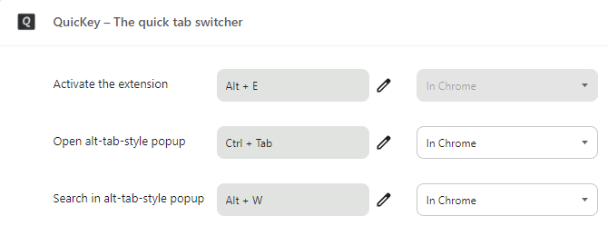

---

title: QuicKey
comments: true

---

# Use <b><kbd>ctrl</kbd><kbd>tab</kbd></b> as a QuicKey shortcut

Do you wish Chrome had the same <b><kbd>ctrl</kbd><kbd>tab</kbd></b> tab navigation as Firefox?  There are two key features Chrome is missing:

- **Switch to the previously used tab**
  - Press <b><kbd>ctrl</kbd><kbd>tab</kbd></b> and then release both keys

- **Select an open tab from a menu using the keyboard**
  - Press <b><kbd>ctrl</kbd><kbd>tab</kbd></b> but then release just <kbd>tab</kbd>
  - Press <kbd>tab</kbd> repeatedly to select older tabs in the menu
  - Release <kbd>ctrl</kbd> to switch to the selected tab

Chrome extensions can't provide this functionality all by themselves, unfortunately.  With a little work, however, it *is* possible to achieve both these features with *QuicKey*, though the second one requires some additional Windows-only software.  (*QuicKey* does support [keyboard-driven selection](/QuicKey/#mru-gif) of a tab from a menu without any additional setup; it's just that you can't use <b><kbd>ctrl</kbd><kbd>tab</kbd></b> as the shortcut without these manual workarounds.)

You can use either of the options below, but don't use both.  Following the steps in [Option 1](#option-1) will prevent [Option 2](#option-2) from working correctly.

## Option 1: Use <b><kbd>ctrl</kbd><kbd>tab</kbd></b> to switch to previously used tabs

Chrome's *Keyboard shortcuts* screen normally blocks you from using <b><kbd>ctrl</kbd><kbd>tab</kbd></b> as a shortcut, but it is possible to use the Chrome developer tools to work around this limitation. (This is also much simpler than other approaches that require messing around with Chrome's preferences files.)

1. [Install QuicKey](https://chrome.google.com/webstore/detail/quickey-%E2%80%93-the-quick-tab-s/ldlghkoiihaelfnggonhjnfiabmaficg).

2. Right-click the *QuicKey* icon  and select *Options* from the menu.

    

3. After the *Keyboard shortcuts* page opens, press <b><kbd>ctrl</kbd><kbd>shift</kbd><kbd>J</kbd></b> on Windows/Linux or <b><kbd>cmd</kbd><kbd>opt</kbd><kbd>J</kbd></b> on macOS to open the Chrome DevTools.

    

4. Copy this block of code:

       chrome.developerPrivate.updateExtensionCommand({
           extensionId: "ldlghkoiihaelfnggonhjnfiabmaficg",
           commandName: "1-previous-tab",
           keybinding: "Ctrl+Tab"
       });
       chrome.developerPrivate.updateExtensionCommand({
           extensionId: "ldlghkoiihaelfnggonhjnfiabmaficg",
           commandName: "2-next-tab",
           keybinding: "Ctrl+Shift+Tab"
       });

    <button class="copy" onclick="copyCode()">Copy to Clipboard</button>

5. Click into the console area of DevTools and paste the code next to the >.

    

6. Press <kbd>enter</kbd> to run it.

    

That's it!

Now you can press <b><kbd>ctrl</kbd><kbd>tab</kbd></b> to switch to the previously used tab.  If you press it again within .75 seconds, while the icon is inverted , you'll switch to the tab before that.  You can press <b><kbd>ctrl</kbd><kbd>shift</kbd><kbd>tab</kbd></b> to navigate in the other direction.

If you later change your mind and want to remove these shortcuts, just go back into the *Keyboard shortcuts* screen and click the delete button next to the shortcuts, or change them to something else.

(You should always be cautious about copying code from a website and running it in DevTools, but even if you don't know JavaScript, it's hopefully clear what the snippet above is doing.  It's calling a private updateExtensionCommand() function twice to set <b><kbd>ctrl</kbd><kbd>tab</kbd></b> and <b><kbd>ctrl</kbd><kbd>shift</kbd><kbd>tab</kbd></b> keyboard shortcuts.  The "ldlgh..." string is *QuicKey*'s extension ID, which you can see in its [Chrome webstore link](https://chrome.google.com/webstore/detail/quickey-%E2%80%93-the-quick-tab-s/ldlghkoiihaelfnggonhjnfiabmaficg), so this code won't affect any other extensions you have installed.)

## Option 2: Use <b><kbd>ctrl</kbd><kbd>tab</kbd></b> to switch to a tab via a menu (Windows only)

This option provides the closest experience to Firefox.  It lets you quickly press and release <b><kbd>ctrl</kbd><kbd>tab</kbd></b> to switch to the previous tab, while also showing a menu of recent tabs if you hold down <kbd>ctrl</kbd>.

1. [Install QuicKey](https://chrome.google.com/webstore/detail/quickey-%E2%80%93-the-quick-tab-s/ldlghkoiihaelfnggonhjnfiabmaficg).

2. Download and install [AutoHotkey](https://www.autohotkey.com/download/ahk-install.exe), a Windows utility for remapping keys.

3. Press <b><kbd>Win</kbd><kbd>R</kbd></b> to open the *Run* dialog.  (Or click the Start menu, type "run", and pick the first result.)

4. Type `shell:startup` into the dialog and press <kbd>enter</kbd> to open your PC's startup folder.

6. Download [`quickey-ctrl-tab.ahk`](quickey-ctrl-tab.ahk), an AutoHotkey script that sets up the keyboard shortcuts for *QuicKey*.

7. Drag the `quickey-ctrl-tab.ahk` file to your startup folder and then double-click the file.

Now switch between a few different tabs in Chrome using the mouse (since *QuicKey* was just installed, it won't have any recent tab history).  Then press and release <b><kbd>ctrl</kbd><kbd>tab</kbd></b> to switch to the previous tab.

If you press <b><kbd>ctrl</kbd><kbd>tab</kbd></b> and keep holding <kbd>ctrl</kbd>, a menu of recent tabs will open.  Press <kbd>tab</kbd> to move the selection down in the list, <b><kbd>shift</kbd><kbd>tab</kbd></b> to move up.  When the desired tab is selected, release <kbd>ctrl</kbd> to switch to it.

The other default shortcuts continue to work, so you can still press <b><kbd>alt</kbd><kbd>Q</kbd></b> to open *QuicKey* and search for a tab by name or URL instead of picking a recent one.

Note that with either option above, you'll obviously lose the <b><kbd>ctrl</kbd><kbd>tab</kbd></b> and <b><kbd>ctrl</kbd><kbd>shift</kbd><kbd>tab</kbd></b> keyboard shortcuts to move the next or previous tab within the current window.  On Windows and Linux, you can use <b><kbd>ctrl</kbd><kbd>pg dn</kbd> / <kbd>pg up</kbd></b> to move to the next/previous tab, and on macOS you can use <b><kbd>cmd</kbd><kbd>opt</kbd><kbd>→</kbd> / <kbd>←</kbd></b>.

