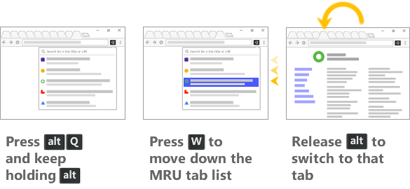

If you like to keep lots of tabs open in Chrome, it can quickly become difficult to find the one you want.  The tabs get very small, so you have to hover over each one to see its name in a tooltip.  And there's no overall Windows menu that would let you more easily pick a tab from a list.

*QuicKey* lets you navigate your hundreds of Chrome tabs by typing just part of the page's title or URL.  No mouse needed!

  * Press <b><kbd>alt</kbd><kbd>Q</kbd></b> (<b><kbd>ctrl</kbd><kbd>Q</kbd></b> on macOS).
  * Type a few letters.
  * Press enter to switch to the selected tab.

To toggle between the two most recently used tabs, quickly press the keyboard shortcut twice.  Or navigate the full most recently used (MRU) tab list as [shown below](#mru).

You can also type <b><kbd>/</kbd><kbd>b</kbd></b> to search bookmarks or <b><kbd>/</kbd><kbd>h</kbd></b> to search your browser history.

## Installation

<button id="install" onclick="chrome.webstore.install()">Install Now</button> or go to the [Chrome Web Store](https://chrome.google.com/webstore/detail/quickey-–-the-quick-tab-s/ldlghkoiihaelfnggonhjnfiabmaficg).

Once the extension is installed, you can click the  button on the toolbar to open the search box.  But if you're using this extension, you'll probably prefer using the default keyboard shortcut listed above.

Customize the shortcut key by going to the main menu and then go to *More tools > Extensions*, scroll to the very bottom of the page, and then click *Keyboard Shortcuts*.

## Search for a tab quickly

Unlike other tab switchers, *QuicKey* uses a [Quicksilver](https://qsapp.com/)-style search algorithm to rank the results, where contiguous matches at the beginning of words are higher in the list, as are matches against capital letters.  So you can type just a few letters to quickly find the right tab.

Use a keyboard shortcut to navigate the tab list:

  * <kbd>enter</kbd>&nbsp;: switch to the selected tab
  * <kbd>↓</kbd> or <kbd>space</kbd>&nbsp;: move down the list
  * <kbd>↑</kbd> or <b><kbd>shift</kbd><kbd>space</kbd></b>&nbsp;: move up the list
  * <kbd>pg dn</kbd>&nbsp;: page down the list
  * <kbd>pg up</kbd>&nbsp;: page up the list
  * <kbd>end</kbd>&nbsp;: go to the bottom of the list
  * <kbd>home</kbd>&nbsp;: go to the top of the list
  * <kbd>esc</kbd>&nbsp;: clear the search or close the menu

If you type more than 25 letters, which should be plenty to find the right tab, *QuicKey* switches to an exact string search to stay fast.

Recently used tabs get a slight boost in the search results ranking, so getting back to a tab you were just using should require typing fewer letters.

## Navigate the most recently used (MRU) tabs

When first installed, *QuicKey* won't have any tab usage history.  But over time, opening the extension will display the list of tabs you've visited, in order of recency.  Click a tab to switch to it, or use one of the keyboard shortcuts below to navigate the recently used tab history:

 

  * **To switch to the previously active tab:**
      * Quickly double-press the <b><kbd>alt</kbd><kbd>Q</kbd></b> or <b><kbd>ctrl</kbd><kbd>Q</kbd></b> shortcut.

 

  * **To navigate farther back in the MRU list:**
    * Press <b><kbd>alt</kbd><kbd>A</kbd></b> (<b><kbd>ctrl</kbd><kbd>A</kbd></b> on macOS) once to switch to the previous tab.  The *QuicKey* icon will invert for .75 seconds: <b> ➤ </b>.
    * Press <b><kbd>alt</kbd><kbd>A</kbd></b> again while the icon is inverted to switch to older tabs, once for each tab.
    * Press <b><kbd>alt</kbd><kbd>shift</kbd><kbd>A</kbd></b> to move to newer tabs.
    * Pause to let the icon revert to normal: <b> ➤ </b>.
    * Press <b><kbd>alt</kbd><kbd>A</kbd></b> again to switch back to the tab you initially started on.

 

  * **To pick a recent tab from the MRU menu:**
    * Press the shortcut but keep holding the <kbd>alt</kbd> key (<kbd>ctrl</kbd> key on macOS).
    * Press <kbd>W</kbd> to move down through the list of recent tabs.
    * Press <b><kbd>shift</kbd><kbd>W</kbd></b> to move up.
    * Release <kbd>alt</kbd> (or <kbd>ctrl</kbd>) to switch to the selected tab.
    * You can also highlight an item with the mouse, then release <kbd>alt</kbd> to go to that tab.

Which shortcuts to use is up to you.  Double-pressing <b><kbd>alt</kbd><kbd>Q</kbd></b> is nice because there's just one shortcut and you can switch between the two most recently used tabs as quickly as you want.

<b><kbd>alt</kbd><kbd>A</kbd></b> lets you quickly navigate to even older tabs, though the timing can be a little tricky.

Selecting from the MRU menu by holding down the <kbd>alt</kbd> key provides the closest experience to a typical <b><kbd>alt</kbd><kbd>tab</kbd></b> menu, but you need to use a different key to navigate the list while the menu is open (due to limitations in Chrome extensions).

You can change the <b><kbd>alt</kbd><kbd>A</kbd></b> shortcut by opening the main menu and then going to *More tools > Extensions*, scrolling to the very bottom of the page, and then clicking *Keyboard Shortcuts*.

## Search bookmarks

To find a bookmark, type <b><kbd>/</kbd><kbd>b</kbd><kbd>space</kbd></b> in the search box, and then part of the bookmark's name or URL.

  * Press <kbd>enter</kbd> to open the bookmark in the current tab.
  * Press <b><kbd>ctrl</kbd><kbd>enter</kbd></b> (<b><kbd>cmd</kbd><kbd>enter</kbd></b> on macOS) to open it in a new tab in the current window.
  * Press <b><kbd>shift</kbd><kbd>enter</kbd></b> to open it in a new window.

## Search the browser history

To find something in the last 2000 pages of your browser history, type <b><kbd>/</kbd><kbd>h</kbd><kbd>space</kbd></b> in the search box, and then part of the page's name or URL.

The same <b><kbd>ctrl</kbd><kbd>enter</kbd></b> (<b><kbd>cmd</kbd><kbd>enter</kbd></b> on macOS) and <b><kbd>shift</kbd><kbd>enter</kbd></b> shortcuts will open the visited page in a new tab or window.

##  The Great Suspender integration

If you use the handy extension [The Great Suspender](https://chrome.google.com/webstore/detail/the-great-suspender/klbibkeccnjlkjkiokjodocebajanakg?hl=en) (and you almost certainly are if you have hundreds of tabs open), then suspended tabs will look faded in the list, and the original URL is shown (not that long one that you see in the location bar).  That means if you search for `chrome` or `extension`, you won't simply match all the suspended tabs, which is what happens in other tab search extensions.

Press <b><kbd>shift</kbd><kbd>enter</kbd></b> to switch to a tab and unsuspend it in one go. Or shift-click it with the mouse.

Sometimes The Great Suspender seems to forget the page's favicon and just shows its own in the tab.  In that case, *QuicKey* will try to show the correct favicon in its list of tabs.

## Move tabs

You can also move tabs to the left or right of the current tab, making it easy to pull tabs from other windows into the current one, or to rearrange tabs without using the mouse.

  * Press <b><kbd>ctrl</kbd><kbd>[</kbd></b> to move the selected tab to the left of the current one.
  * Press <b><kbd>ctrl</kbd><kbd>]</kbd></b> to move it to the right.

Include <kbd>shift</kbd> in the shortcut to also unsuspend the tab while moving it.  The <kbd>ctrl</kbd> key should be used on both Windows and macOS.

## Close tabs

To close the selected tab, press <b><kbd>ctrl</kbd><kbd>W</kbd></b> (<b><kbd>cmd</kbd><kbd>ctrl</kbd><kbd>W</kbd></b> on macOS).  So you could, for instance, type `docg` to match all of your Google Docs URLs and then quickly close those you no longer need.

## Incognito mode

By default, Chrome extensions are not enabled in incognito mode when you first install them.  If you want to use *QuicKey* to switch to incognito tabs as well as normal ones, open the main menu and then go to *More tools > Extensions*, scroll down to the *QuicKey* extension, and check the *Allow in incognito* option.

Tabs in incognito mode display the incognito icon, so you can distinguish a normal tab from an incognito one with the same title.

## Privacy policy

To function, *QuicKey* needs access to your open tabs, bookmarks and history.  The Chrome permissions dialog says *QuicKey* can also change your bookmarks and browsing history, but it never will.  It can't access the page content at all and doesn't transmit any information other than some anonymized Google Analytics metrics.

## Feedback and bugs

If you find a bug in *QuicKey* or have a suggestion for a new feature, please [create a new issue](https://github.com/fwextensions/QuicKey/issues/new) on its GitHub page.

## Credits

The  and  icons are from the [Octicons](https://octicons.github.com/) set, used under the [MIT License](http://opensource.org/licenses/MIT).

The string ranking algorithm is modeled on [Quicksilver](https://github.com/quicksilver/Quicksilver/blob/master/Quicksilver/Code-QuickStepCore/QSense.m)'s code.
