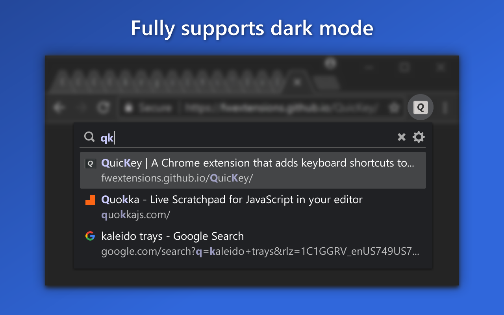

---

title: QuicKey
image: img/og-image.png
comments: true

---

  

    <ul class="glide__slides">
      <li class="glide__slide"></li>
      <li class="glide__slide"></li>
      <li class="glide__slide"></li>
      <li class="glide__slide"></li>
      <li class="glide__slide"></li>
    </ul>
  

#### *QuicKey* lets you navigate all of your Chrome tabs by typing just part of a page's title or URL.  No mouse needed!

## Installation

Install *QuicKey* from the <a href="https://chrome.google.com/webstore/detail/quickey-–-the-quick-tab-s/ldlghkoiihaelfnggonhjnfiabmaficg">Chrome Web Store</a>.

Once the extension is installed, you can click the  button on the toolbar to open the search box.  But if you like this extension, you'll probably prefer using the default keyboard shortcut listed above.

You can customize the shortcut key by right-clicking the *QuicKey* icon and selecting *Options*.  Or manually add a <b><kbd>ctrl</kbd><kbd>tab</kbd></b> [keyboard shortcut](ctrl-tab).

## Switch between the most recently used tabs

> **Note:** If you've been using *QuicKey* before 2.0, you'll need to set keyboard shortcuts for the new commands that show the popup window, as they won't be set by default. 

Opening *QuicKey* displays a list of the last 50 tabs you've visited, in order of recency.  (When you first start using *QuicKey*, though, it won't know what's recent, so the list will be empty.)  Click a tab to switch to it, or use one of the keyboard shortcuts below to navigate the recently used tab history:

&nbsp;

  * **To pick a recent tab from the MRU list in the popup window:**
    * Press <b><kbd>alt</kbd><kbd>Q</kbd></b> (<b><kbd>ctrl</kbd><kbd>Q</kbd></b> on macOS) but keep holding the modifier key.
    * Press <kbd>Q</kbd> or <kbd>↓</kbd> to move down through the list of recent tabs.
    * Press <b><kbd>shift</kbd><kbd>Q</kbd></b> or <kbd>↑</kbd> to move up.
    * Release <kbd>alt</kbd> (or <kbd>ctrl</kbd>) to switch to the selected tab.
    * You can also highlight an item with the mouse, then release <kbd>alt</kbd>/<kbd>ctrl</kbd> to go to that tab.

&nbsp;

  * **To quickly switch between the two most recent tabs:**
      * Press <b><kbd>alt</kbd><kbd>Z</kbd></b> (<b><kbd>ctrl</kbd><kbd>S</kbd></b> on macOS). 

&nbsp;

You can also view each tab as you navigate through the recents list, taking as long as you want on each, and then release the modifier key to stay on that tab. Make sure the shortcuts are set by right-clicking the *QuicKey* icon and selecting *Options*. Then click *Keyboard shortcuts*, scroll down, and click *Change browser shortcuts*. Look for the *Switch to the previous/next tab* commands and set these suggested shortcuts: <b><kbd>alt</kbd><kbd>A</kbd></b> and <b><kbd>alt</kbd><kbd>S</kbd></b>, respectively (<b><kbd>ctrl</kbd><kbd>S</kbd></b> and <b><kbd>ctrl</kbd><kbd>D</kbd></b> on macOS).

&nbsp;

  * **To navigate while viewing each recent tab:**
    * Press <b><kbd>alt</kbd><kbd>A</kbd></b> (<b><kbd>ctrl</kbd><kbd>S</kbd></b> on macOS) to display the previous tab, but keep holding the modifier key. The popup window will stay open on the right side of the screen. 
    * Press <kbd>A</kbd> to move down the list, displaying each tab in turn.
    * Press <kbd>S</kbd> to move back up.
    * Release <kbd>alt</kbd> (or <kbd>ctrl</kbd>) to stay on the current tab.
    * Press <b><kbd>alt</kbd><kbd>A</kbd></b> again to switch back to the tab you initially started on.

## Use <b><kbd>ctrl</kbd><kbd>tab</kbd></b> to switch between recent tabs

With a little extra work, you can even make *QuicKey* respond to the Holy Grail of keyboard shortcuts: <b><kbd>ctrl</kbd><kbd>tab</kbd></b>.  

[Learn how](ctrl-tab).

## Search for a tab quickly

Unlike other tab switchers, *QuicKey* uses a [Quicksilver](https://qsapp.com/)-style search algorithm to rank the results, where contiguous matches at the beginning of words are higher in the list, as are matches against capital letters.  So you only have to type a few letters to quickly find the right tab.

  * **To search for a recent tab in the popup window:**
    * Press and release <b><kbd>alt</kbd><kbd>W</kbd></b> (<b><kbd>ctrl</kbd><kbd>W</kbd></b> on macOS). 
    * Type one or more search terms, separated by spaces.
    * Use one of the shortcuts below to navigate the list.
    * Press <kbd>enter</kbd> to switch to the selected tab.

List navigation shortcuts:

  * <kbd>↓</kbd>, <kbd>space</kbd>, <b><kbd>ctrl</kbd><kbd>N</kbd></b> or <b><kbd>ctrl</kbd><kbd>J</kbd></b>&nbsp;: move down the list
  * <kbd>↑</kbd>, <b><kbd>shift</kbd><kbd>space</kbd></b>, <b><kbd>ctrl</kbd><kbd>P</kbd></b> or <b><kbd>ctrl</kbd><kbd>K</kbd></b>&nbsp;: move up the list
  * <kbd>pg dn</kbd>&nbsp;: page down the list
  * <kbd>pg up</kbd>&nbsp;: page up the list
  * <kbd>end</kbd>&nbsp;: go to the bottom of the list
  * <kbd>home</kbd>&nbsp;: go to the top of the list
  * <kbd>enter</kbd>&nbsp;: switch to the selected tab
  * <kbd>esc</kbd>&nbsp;: clear the search or close the popup window or menu

Recently used tabs get a slight boost in the search results ranking, so getting back to a tab you were just using should require typing fewer letters.

Typing a space lets you enter multiple tokens in the query, all of which must match either the tab's title or URL, in any order.

If you type more than 25 letters, which should be plenty to find the right tab, *QuicKey* switches to an exact string search to stay fast.

## Customize shortcuts and other options

To customize how *QuicKey* behaves, click the  icon in the popup window or menu, or right-click its toolbar icon  and select *Options*:

There you can:

  * Customize keyboard shortcuts
  * Change the popup window's behavior
  * Hide closed tabs from the search results
  * Limit tab navigation or search to the current browser window
  * Mark tabs in other browser windows with an icon
  * Show the number of open tabs
  * Restore the last search query when reopening the popup window or menu
  * Use pinyin to search for Chinese characters

When a *QuicKey* update adds new settings, the  icon will display a red dot to let you know.

## Limit navigation to the current browser window

If you have multiple browser windows open, you may want to navigate among only the recent tabs that are in the current window. To enable this behavior, open the *Options* page to the *General* tab and select *Limit recent tabs to the current browser window*. Pressing the shortcuts for *Switch instantly between the two most recent tabs* or *Switch to the previous tab* will then switch only between recent tabs in the current window.

You can also limit searching for tabs to the current browser window.

## Close and reopen tabs

To close the selected tab, press <b><kbd>ctrl</kbd><kbd>W</kbd></b> (<b><kbd>cmd</kbd><kbd>ctrl</kbd><kbd>W</kbd></b> on macOS, <b><kbd>ctrl</kbd><kbd>alt</kbd><kbd>W</kbd></b> on Linux).  Or hover over a tab and click the close button on the right side of the list:

When you open *QuicKey*, the 25 most recently closed tabs are listed below the recent tabs and shown in a faded state with a  icon:

They are also returned when you type a query, though their rank in the list of results is lower than open tabs.  Click a closed tab to reopen it in its original location and with all of its browsing history intact.

If you don't want any closed tabs to be shown, open the *QuicKey options* page and uncheck *Include recently closed tabs in the search results* in the *General* section.  You can also remove the selected closed tab from the browser's history by pressing <b><kbd>ctrl</kbd><kbd>W</kbd></b> (<b><kbd>cmd</kbd><kbd>ctrl</kbd><kbd>W</kbd></b> on macOS) or by clicking its  button on the right side of the list. 

## Move tabs

You can move tabs to the left or right of the current tab, making it easy to pull tabs from other windows into the current one, or to rearrange tabs without using the mouse.

  * Press <b><kbd>ctrl</kbd><kbd>[</kbd></b> to move the selected tab to the left of the current one.
  * Press <b><kbd>ctrl</kbd><kbd>]</kbd></b> to move it to the right.

The <kbd>ctrl</kbd> key should be used on both Windows and macOS.  Note that you cannot move tabs between normal and incognito windows.

## Distinguish tabs with identical titles

A tab that has the same title as other open tabs will display a number to indicate its left-to-right position among those other tabs.  For instance, if you open tabs for two different Google Drive accounts, they'll both be titled *My Drive - Google Drive*.  But the one on the left will show a **1** next to its title in the list and the one on the right will show a **2**.  This makes it easier for you to select the tab you want when you know how they're organized in your window.   

## Search bookmarks

To find a bookmark, type <b><kbd>/</kbd><kbd>b</kbd><kbd>space</kbd></b> in the search box, and then part of the bookmark's name or URL.

  * Press <kbd>enter</kbd> to open the bookmark in the current tab.
  * Press <b><kbd>ctrl</kbd><kbd>enter</kbd></b> (<b><kbd>cmd</kbd><kbd>enter</kbd></b> on macOS) to open it in a new tab in the current window.
  * Press <b><kbd>shift</kbd><kbd>enter</kbd></b> to open it in a new window.

As soon as you type <b><kbd>/</kbd><kbd>b</kbd><kbd>space</kbd></b>, your bookmarks will be listed in alphabetical order, in case you want to browse through them.  Since bookmarks can be organized into folders, the folder path is shown before each bookmark's title.  The folder path can be hidden by unchecking *Show the folder path to each bookmark in its title* on the Options page.

## Search the browser history

To find something in the last 2000 pages of your browser history, type <b><kbd>/</kbd><kbd>h</kbd><kbd>space</kbd></b> in the search box, and then part of the page's name or URL.

The same <b><kbd>ctrl</kbd><kbd>enter</kbd></b> (<b><kbd>cmd</kbd><kbd>enter</kbd></b> on macOS) and <b><kbd>shift</kbd><kbd>enter</kbd></b> shortcuts will open the visited page in a new tab or window.

As soon as you type <b><kbd>/</kbd><kbd>h</kbd><kbd>space</kbd></b>, the pages from your history will be listed in order of recency, so you can get back to a page you had recently visited without having to remember its name.

## Delete bookmarks and history items

To delete the selected bookmark or history item, press <b><kbd>ctrl</kbd><kbd>W</kbd></b> (<b><kbd>cmd</kbd><kbd>ctrl</kbd><kbd>W</kbd></b> on macOS). Or hover over an item and click the  button on the right side of the list. You'll be asked to confirm the deletion of bookmarks.

## Incognito mode

To switch to incognito tabs as well as normal ones, right-click the *QuicKey* icon  and select *Options* from the menu:

Scroll to the very bottom of the *General* section and then click the *Change incognito settings* button.  On the extensions page that opens, scroll down to the *Allow in incognito* option and click the toggle button:

Tabs in incognito mode display the incognito icon under the page's favicon, so you can distinguish a normal tab from an incognito one with the same title:

## Dark mode

*QuicKey* will respond to changes in your computer's dark mode setting with darker colors that match your browser's user interface.

## Copy a URL or title

You can also copy the URL and title of the selected tab, bookmark or history item:

  * Press <b><kbd>ctrl</kbd><kbd>C</kbd></b> (<b><kbd>cmd</kbd><kbd>C</kbd></b> on macOS) to copy just the URL.
  * Press <b><kbd>ctrl</kbd><kbd>shift</kbd><kbd>C</kbd></b> (<b><kbd>cmd</kbd><kbd>shift</kbd><kbd>C</kbd></b> on macOS) to copy both the item's title and its URL, one per line.

## Privacy policy

When first installed, *QuicKey* asks for these permissions:

- *Read and change your browsing history on all your signed-in devices*

    *QuicKey* uses this permission to let you search the titles and URLs of the open tabs, as well as pages from your history. The *"all your signed-in devices"* part is there only so that recently closed tabs can be restored with their full history. The only time *QuicKey* changes your browsing history is when you choose to delete a history item. 

- *Read and change your bookmarks*

    *QuicKey* uses this permission to let you search the titles and URLs of your bookmarked pages. The only time it changes your bookmarks is when you choose to delete one.

*QuicKey* can't access or manipulate the content of any pages you visit and doesn't transmit any information other than some anonymized diagnostic data. It never sends anything about the pages you visit.

For the technically-minded, you can inspect *QuicKey*'s code on [GitHub](https://github.com/fwextensions/QuicKey).

## Feedback and support

If you find a bug in *QuicKey* or have a suggestion for a new feature, please visit the [support page](./support).

## Release history

View the changes in [previous releases](./releases).

## Credits

The , , ,  and  icons are from the [Octicons](https://octicons.github.com/) set, used under the [MIT License](http://opensource.org/licenses/MIT).  The  icon is from the [Material Icons](https://material.io/tools/icons/) set, used under the [Apache License](https://www.apache.org/licenses/LICENSE-2.0.html).

The string ranking algorithm is modeled on [Quicksilver](https://github.com/quicksilver/Quicksilver/blob/master/Quicksilver/Code-QuickStepCore/QSense.m)'s code.
